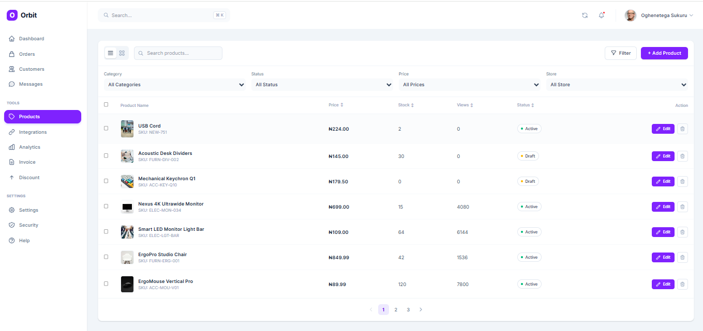

````markdown
# Product Management Dashboard

A high-performance, responsive product management interface built for complex full-stack architectures.

## 🚀 Live Demo
[Insert Vercel/Netlify Link Here]

## 🛠️ Core Stack
* **Framework:** Next.js (App Router)
* **Language:** TypeScript
* **State Management:** TanStack Query (React Query)
* **Styling:** Tailwind CSS (featuring Glassmorphism & Bento Grid layouts)
* **Validation:** React Hook Form + Zod
* **Mock API:** MockAPI.io

## 📐 Technical Decisions

1. **TanStack Query over Redux/Context:** Selected for its superior server-state management. It handles caching, loading/error states, and optimistic updates out of the box, drastically reducing boilerplate compared to Redux.
2. **Component Architecture:** Separated the API client logic (`lib/api.ts`) from the UI components. This ensures the React components remain pure and solely focused on presentation and local state.
3. **UI/UX Approach:** Implemented a Bento Grid layout for product cards to surface deeper metrics (price, stock status) at a glance, moving away from standard, data-dense tables. Glassmorphism was used for modals to maintain context without losing the user's place on the dashboard.
4. **Strict Typing:** Zod was integrated with React Hook Form to ensure absolute type safety from the UI input level straight down to the API payload.

## 💻 Local Setup Instructions

1. **Clone the repository:**
   ```bash
   git clone [https://github.com/yourusername/product-dashboard.git](https://github.com/yourusername/product-dashboard.git)
````

2. **Install dependencies:**

    ```bash
    npm install
    ```

3. **Set up your environment variables:**
    Create a `.env.local` file in the root and add your MockAPI endpoint:

    ```env
    NEXT_PUBLIC_API_URL=mockapi_api_url
    ```

4. Run the development server:

    ```bash
    npm run dev
    ```

5. Open http://localhost:3000 in your browser.


## 📂 Project Architecture

```text
product-dashboard/
├── app/
│   ├── globals.css            
│   ├── layout.tsx              
│   ├── page.tsx       
│   └── providers.tsx
├── components/
│   ├── DashboardLayout.tsx
│   ├── FilterBar.tsx
│   ├── Modal.tsx
│   ├── Pagination.tsx
│   ├── ProductDataTable.tsx
│   ├── ProductDetailsDrawer.tsx
│   ├── ProductForm.tsx
│   ├── ProductTable.tsx  
│   └── TopActionBar.tsx     
├── hooks/               
│   ├── useDebounce.ts
│   ├── useProductFormLogic.ts
│   ├── useProducts.ts
│   └── useProductTableLogic.ts
├── lib/               
│   ├── api.ts
│   └── validations.ts
├── types/   
│   └── products.ts
└── public/             
```

## 📸 Screenshots


Developed by Oghenetega Sukuru for the Frontend Technical Assessment.

## 📄 License

This project is licensed under the MIT License.

```

